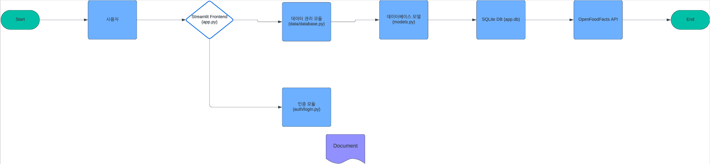

## 🥩영양갱(건강한 식단 관리 서비스)🍜
202284057이건해 202204060 이승우.

### 동기및 목적

 다양한 식품 선택으로 인해 자신의 영양소 섭취를 체계적으로 관리하기가 쉽지 않습니다. 이러한 문제를 해결하기 위 이 프로젝트는 사용자가 간편하게 자신의 식단을 기록하고 분석할 수 있는 플랫폼을 제공하고자 합니다. 사용자들이 자신의 영양소 섭취를 쉽게 파악하고 균형 잡힌 식단을 유지할 수 있도록 돕습니다

## 시스템 구조

1. 사용자는 Streamlit 프론트엔드를 통해 시스템과 상호작용한다.
2. Streamlit 프론트엔드는 데이터 관리 모듈이나 인증 모듈과 통신한다.
3. 데이터 관리 모듈은 데이터베이스 모델과 상호작용하고, SQLite DB에서 데이터를 가져온다.
4. 인증 모듈은 데이터베이스와 상호작용하여 사용자 인증을 처리한다.
5. OpenFoodFacts API를 통해 외부 데이터도 불러온다.

   

## 관련 연구
  

Lifesum은 건강 관리와 식단 추적을 위한 인기 있는 애플리케이션으로 사용자들이 건강한 식습관을 형성하고 유지할 수 있도록 다양한 기능을 제공하여, 체중 관리뿐만 아니라 전반적인 건강 증진을 도와줍니다.

## 개발 방법론

-애자일 방법론을 기반으로 진행됩니다  2주 단위마다 기능을 개발하고, 테스트하며, 피드백을 반영하여 개선합니다.
- Python을 주요 프로그래밍 언어로 사용하며, Streamlit과 같은 간단한 웹 프레임워크를 활용합니다.

## 주요 기능

|   주요기능    |      내용                            |
| ---------- | ----------------------------------------------- |
| 1. 사용자 인증 시스템   |사용자 로그인 및 로그아웃 기능 제공, 세션 관리로 개인별 데이터 보호          |
|2. 식단 입력 및 관리    |사용자가 일일 식단을 입력하고 데이터베이스에 저장, 식단 내용 수정 및 삭제 기능 지원    |
|3. 음식 검색 및 추가 | OpenFoodFacts API를 활용하여 음식 검색, 영양 정보 조회 후 식단에 음식 추가 기능 제공                   |
|4. 영양소 섭취 분석 | 섭취한 칼로리, 단백질, 탄수화물, 지방 등의 영양소를 분석하여 그래프로 시각화, 영양소 섭취 비율 파악              |
|5.  데이터베이스 관리| SQLite 데이터베이스 초기화 및 관리, 사용자별 식단 데이터 저장 및 조회            |

## 일정

| 주차       |  표 작업                                   |
| ---------- | ----------------------------------------------- |
| 1~2주차    |프로젝트 기획 및 자료 조사                       |
| 3~4주차    | 계획서 발표                         |
| 5~6주차    | 데이터 수집 및 전처리                       |
| 7~8주차    | 사용자 인증 시스템 개발                 |
| 9~10주차   | 식단 입력 및 관리 기능 개발, 식단 데이터 저장 및 수정, 삭제 기능 구현                       |
| 11~12주차  |음식 검색 및 추가 기능 구현, OpenFoodFacts API 연동하여 음식 검색 기능 개발   |
| 13~14주차  | 최종 배포                      |
| 15주차     | 최종 발표                            |

## 기대효과

- 식단 관리를 체계화하여 사용자의 건강 목표 달성을 돕습니다.
- 영양소 분석을 통해 건강한 식습관 형성을 촉진합니다.
- 개인 맞춤형 피드백 제공으로 사용자 만족도와 건강 관리의 효율성이 향상됩니다.
